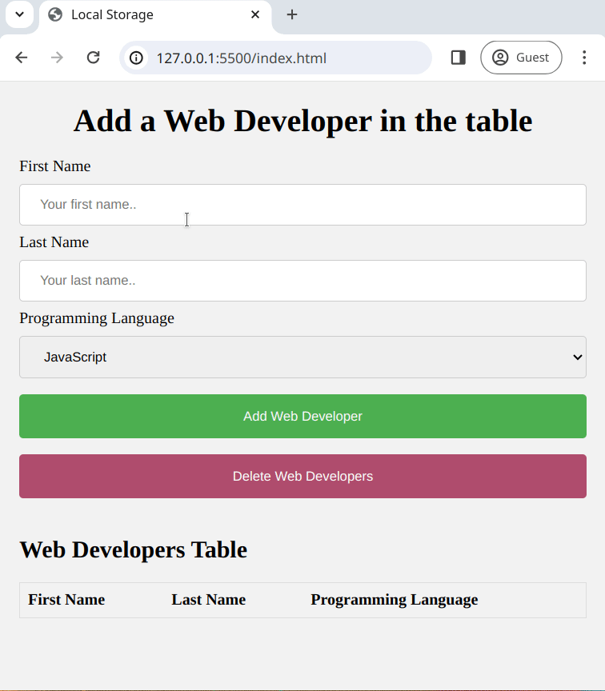

# Working with localStorage

This project demonstrates how to use the **localStorage API** to store and retrieve data in the browser. The stored data persists even when the browser or tab is closed, making it a powerful tool for building dynamic and interactive web applications.

## Project Overview

The application captures user input from a form and saves it to the browser's localStorage. It also displays the stored data in a table and provides options to reset or clear the stored data.

## Features
- Capture and store form data in localStorage.
- Append new data to existing localStorage entries instead of overwriting.
- Dynamically display stored data in an HTML table.
- Clear form fields automatically after submission.
- Reset the localStorage and remove all stored data with a button click.
- Display stored data automatically when the page loads.

## Technologies Used
- **HTML5**: Provides the structure of the form and table.
- **CSS3**: Adds basic styling (if needed).
- **JavaScript (ES6)**: Implements all dynamic functionalities and localStorage interaction.

## How It Works

1. **Add Developer Data**  
   Users can input their first name, last name, and programming language in a form.  
   - Data is saved to localStorage as an array of objects.  
   - The form automatically clears after submission.  

2. **Display Developer Data**  
   A table dynamically updates to show all developers stored in localStorage.

3. **Clear Data**  
   A reset button clears the `developers` entry in localStorage.

4. **Page Initialization**  
   On page load, the application automatically displays the developers stored in localStorage.

## Example Preview
Here’s how the app functions:  



## Getting Started
1. Clone the repository to your local machine:
   ```bash
   git clone <repository-url>
